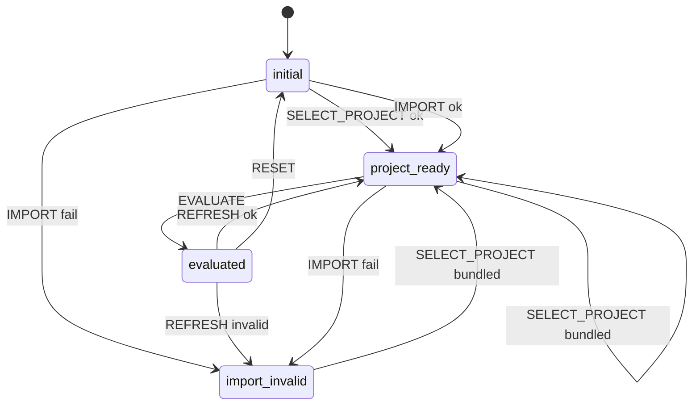

# Import Session State Contract

**Feature**: `002-sharepoint-snapshot-import`  
**Extends**: `specs/001-pm-copilot-demo/contracts/session-state.md`  
**Module**: `src/session/` (reducer extensions)

## SessionState extensions

```typescript
type ProjectMode = 'none' | 'bundled' | 'imported';

interface SessionState {
  // --- 001 fields (unchanged semantics for bundled mode) ---
  sessionId: string;
  persona: Persona;
  phase: SessionPhase;
  selectedProjectId: string | null;
  enabledSignalGroupIds: string[];
  projectLoad: ProjectLoadResult | null;
  invalidProject: InvalidProjectContext | null;
  evaluation: EvaluationResult | null;
  presentation: PersonaPresentation | null;
  ui: SessionUiState;

  // --- 002 extensions ---
  projectMode: ProjectMode;
  importContext: ImportSessionContext | null;
}

type SessionPhase =
  | 'initial'
  | 'project-ready'
  | 'evaluated'
  | 'invalid-project'   // bundled invalid fixture
  | 'import-invalid'    // workbook structural failure
  | 'error';
```

## ImportSessionContext

```typescript
interface ImportSessionContext {
  workbookRef: ImportedWorkbookReference;
  validation: WorkbookValidationResult | null;
  normalizedProject: ImportedSnapshotProject | null;
  refreshState: 'idle' | 'refreshing' | 'needs-reselect';
}
```

`parsedWorkbook` is **not** retained in session after normalization (minimize memory); re-parse on refresh from bytes/handle.

---

## Actions (002 additions)

| Action | Payload | Reducer behaviour |
|--------|---------|-------------------|
| `IMPORT_WORKBOOK_SELECTED` | `{ acquired: AcquiredWorkbook }` | Parse → validate → normalize; set `projectMode: 'imported'`, clear bundled selection, clear evaluation, hide checklist; phase `project-ready` or `import-invalid` |
| `REFRESH_SNAPSHOT` | — | Only when `projectMode === 'imported'`. **File-picker tier**: `fileHandle.getFile()` → latest bytes → re-parse → normalize → `project-ready` (clear evaluation). **File-input tier**: `refreshState: 'needs-reselect'` — user must use **Reselect workbook** (no silent stale read) |
| `RESELECT_WORKBOOK` | — | Open acquisition port; same as new import |
| `SELECT_PROJECT` | `projectId` | **Extended**: clear `importContext`, set `projectMode: 'bundled'`, clear evaluation, restore checklist visibility, then 001 select logic |
| `IMPORT_WORKBOOK_CANCELLED` | — | No-op if picker cancelled |

001 actions `TOGGLE_SIGNAL_GROUP`, `EVALUATE`, `SET_PERSONA`, `REQUEST_RESET`, `CONFIRM_RESET`, `INIT` — behaviour extended where noted below.

---

## Mode orchestration rules

### Bundled → Imported

1. Clear `selectedProjectId`, `evaluation`, `presentation`.
2. Set `enabledSignalGroupIds: []` (checklist hidden — FR-023).
3. Load import context.

### Imported → Bundled

1. Clear `importContext` entirely (workbook bytes, normalized project).
2. Clear `evaluation`, `presentation`.
3. Run `SELECT_PROJECT` bundled path with checklist defaults.

### EVALUATE

| `projectMode` | Behaviour |
|---------------|-----------|
| `bundled` | 001 unchanged |
| `imported` | `enabledSignalGroupIds = ['import-workbook']`; `runEvaluation` with `projectOrigin: 'imported'` |

### TOGGLE_SIGNAL_GROUP

Only processed when `projectMode === 'bundled'`. Ignored (or no-op) when imported.

### SET_PERSONA

Unchanged: re-run `projectForPersona` if evaluation exists — works for imported results (FR-021).

### applyReset / INIT

Clear `importContext`, `projectMode: 'none'`, all 001 reset fields. No workbook data survives (FR-019, SC-005).

---

## UI visibility contract

| Surface | `bundled` | `imported` | `import-invalid` |
|---------|-----------|------------|------------------|
| Sample project selector | Visible | Visible | Visible |
| Integration checklist | Visible | **Hidden** | Hidden |
| Import provenance banner | Hidden | Visible | Hidden |
| Refresh snapshot button | Hidden | Visible when loaded; **Reselect** shown when `refreshState === 'needs-reselect'` (file-input tier) | Hidden |
| Invalid workbook panel | Hidden | Hidden | Visible |
| Health dashboard | Per phase | Per phase | **Hidden** (FR-008) |

---

## Privacy

Reducer MUST NOT:

- Persist `File`, `ArrayBuffer`, or `FileSystemFileHandle` to storage APIs.
- Log workbook cell values or project payloads.

`FileSystemFileHandle` may remain in memory for session refresh only; cleared on reset/reload/mode switch away from import.

---

## Phase diagram



---

## Accessibility notes

- Import control: native button activating hidden file input or picker (keyboard activatable).
- `import-invalid` panel: recovery actions (select sample, reselect workbook) are focusable links/buttons (FR-022, AS-018).
- Refresh / reselect: announce state change via existing error/success region patterns from 001 `ErrorPanel`.
